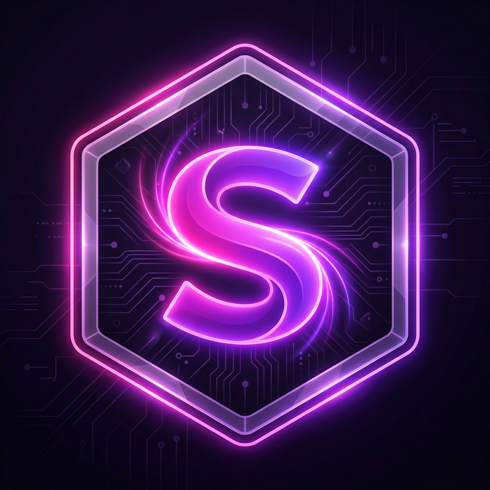

<div align="center">
  
  <h1>🌸 SENJU AI Assistant</h1>
  <p><strong>Smart. Expressive. eXpert. Your-companion.</strong></p>
  <p>A highly advanced, immersive 3D desktop AI assistant built with Electron, featuring multi-LLM support, voice interactions, and a futuristic visual interface.</p>
</div>

---

## ✨ Features

### 🧠 Multi-Model AI Core
- **Google Gemini API** (`gemini-1.5-pro`, `gemini-1.5-flash`) for fast and intelligent text generation.
- **Groq API** (`llama-3.3-70b-versatile`) for ultra-fast conversational responses.
- **Local LLM Support** via `node-llama-cpp` for offline, private AI processing (e.g., LLaMA 3 8B GGUF).

### 🌌 Immersive UI (SENJU Mode)
- **3D Solar System Visualizer**: A fully interactive 3D canvas rendering a solar system where planets represent different file categories and directories.
- **Dynamic Mood Cycling**: UI colors shift dynamically (Sakura, Ocean, Aurora, Lava, Neon, etc.) to keep the interface feeling alive.
- **Futuristic HUD**: Iron Man / Cyberpunk-inspired glassmorphism design with glowing neon borders, real-time typing indicators, and boot sequences.

### 🎙️ Voice & Audio Integration
- **Wake Word Detection**: Powered by Picovoice Porcupine (e.g., saying "Wake up SENJU").
- **Voice Activity Detection (VAD)**: Listens for commands automatically when the mic is active.
- **Speech-to-Text**: Utilizes Whisper via Groq for highly accurate, fast transcription (supports Hinglish/Hindi/English).
- **Text-to-Speech (TTS)**: Microsoft Edge Neural TTS (`hi-IN-SwaraNeural`) for a natural, expressive voice.

### 🔌 Advanced Integrations
- **WhatsApp Web Integration**: Scan a QR code to link your WhatsApp and have SENJU read or send messages (`whatsapp-web.js`).
- **YouTube Search**: Directly search for music and videos via voice commands.
- **System Control**: Adjust Windows system volume (`loudness`) directly from the AI.
- **Reminders & Timetable**: Built-in `electron-store` scheduling system for daily tasks and alarms.

---

## 🛠️ Tech Stack

**Frontend (Renderer)**
- **HTML5 Canvas API** (for the 3D Fibonacci sphere and Solar System math)
- **Vanilla JavaScript & CSS3** (No heavy frameworks, raw performance)
- **Google Fonts**: Orbitron (Sci-Fi headers) & Inter (Clean body text)

**Backend (Main Process)**
- **Electron.js** (Desktop framework)
- **Node.js** (Filesystem, OS level integrations)

**Key NPM Packages**
- `@google/generative-ai` - Gemini AI integration
- `node-llama-cpp` - Local LLM execution
- `whatsapp-web.js` - WhatsApp automation
- `edge-tts-universal` - Neural voice generation
- `@picovoice/porcupine-node` & `pvrecorder-node` - Wake word & audio capture
- `electron-store` - Persistent local storage
- `loudness` - System volume control
- `yt-search` & `youtube-sr` - YouTube integrations

---

## 🚀 Getting Started

### Prerequisites
- Node.js (v18+)
- An active API key for Google Gemini and/or Groq.

### Installation

1. **Clone the repository**
   ```bash
   git clone https://github.com/vivek1234-byte/SENJU_AI.git
   cd SENJU_AI
   ```

2. **Install dependencies**
   ```bash
   npm install
   ```

3. **Configure API Keys**
   Add your API keys to the system settings or `.env` equivalent configuration.

4. **Run the App**
   ```bash
   npm start
   ```

## 🎨 File Structure

```text
SENJU_AI/
├── assets/             # Icons, logos, and background images
├── modules/            # Backend logic (Gemini, Groq, Local LLM, TTS, WhatsApp, Reminders)
├── styles/             # CSS styling (main.css, jarvis.css for 3D HUD)
├── index.html          # Main UI layout and boot sequence
├── main.js             # Electron main process & IPC handlers
├── preload.js          # Electron preload script (Security bridge)
├── renderer.js         # Core frontend logic, 3D math, and UI state
└── package.json        # Dependencies & scripts
```

<div align="center">
  <p>Built for the future. 🚀</p>
</div>
